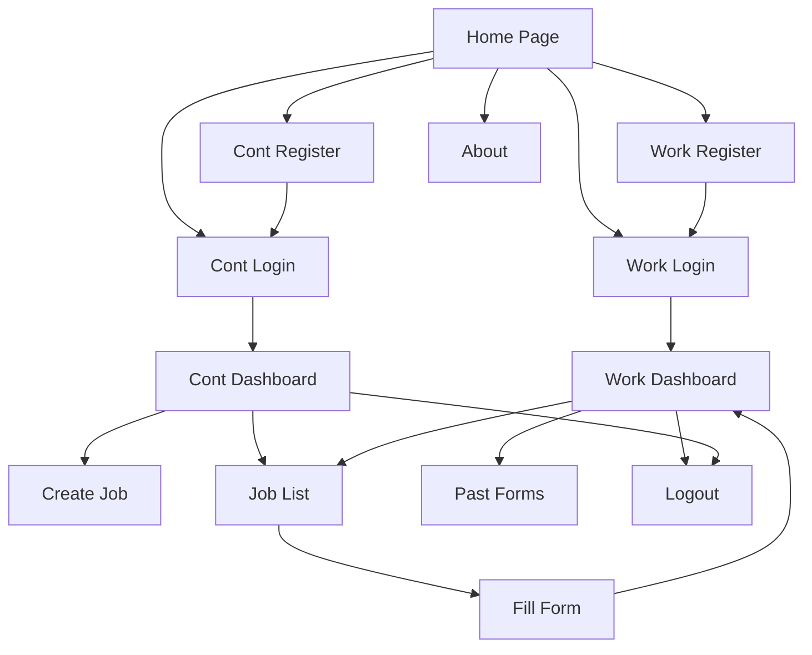

# Workholic

A Flask-based web application for job management, user authentication, and more.

## Features

- User registration and login (for workers and contractors)
- Job creation and listing
- Form filling and dashboard views
- Static assets (images, JS, CSS)
- Multiple database instances for different modules

## Project Structure

```
├── app.py                # Main Flask application
├── requirements.txt      # Python dependencies
├── requirments.txt       # (Alternate) Python dependencies
├── static/               # Static files (images, JS, CSS)
├── templates/            # HTML templates
├── instance/             # SQLite databases
├── env/                  # Python virtual environment
├── .vercel/              # Vercel deployment config
└── __pycache__/          # Python cache files
```

## Getting Started

1. **Install dependencies**  
   Use either `requirements.txt` or `requirments.txt`:
   ```sh
   pip install -r requirements.txt
   # or
   pip install -r requirments.txt
   ```

2. **Run the application**
   ```sh
   python app.py
   ```

3. **Access the app**  
   Open [http://localhost:5000](http://localhost:5000) in your browser.

## Databases

- Located in the `instance/` folder:
  - `contlogindb.db`
  - `fill_formdb.db`
  - `jobsdb.db`
  - `worklogindb.db`


# Project Flow Diagram


- **Home Page**: Entry point for all users.
- **Work/Cont Register/Login**: Separate flows for worker and contractor registration/login.
- **Dashboards**: After login, users access their respective dashboards.
- **Job Management**: Contractors can create jobs; workers can view and apply.
- **Forms**: Workers fill forms for jobs; past forms can be viewed.
- **Logout/About**: Accessible from dashboards and home.


Images of Project

Home Page


Worker Portal 


About Us


Contracter Portal


